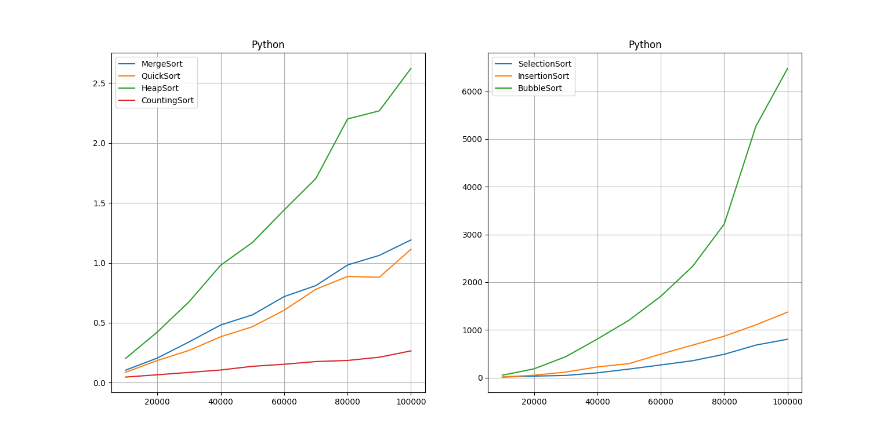
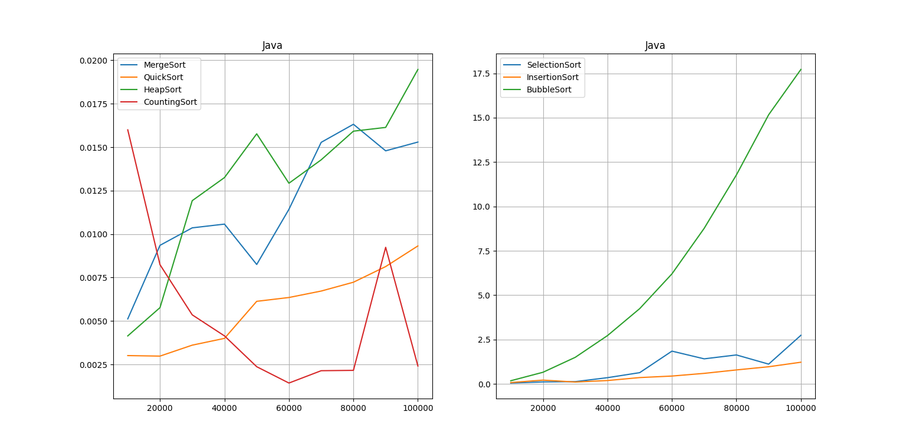
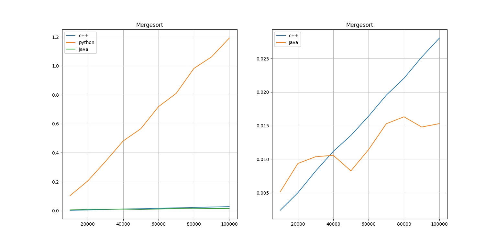
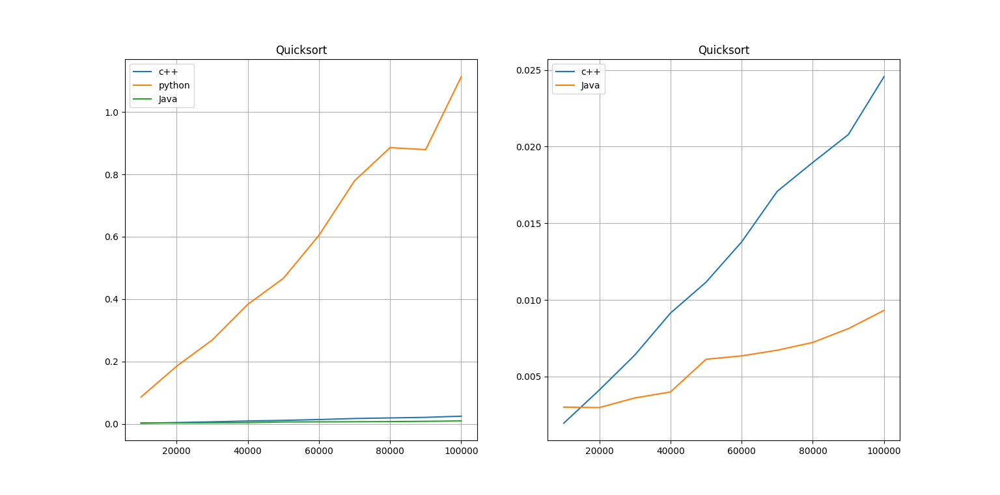
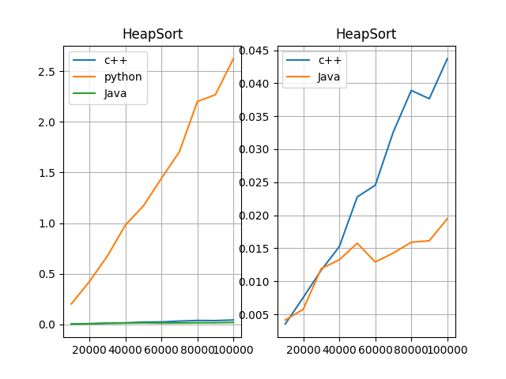
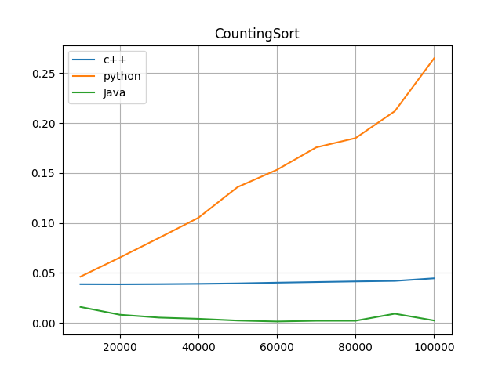

# Algoritmos de ordenamiento

### Alumnos
* [Kate Olazabal Chávez](https://github.com/KateOlaz)
* [Jhon I. Flores Pacheco](https://github.com/leviroseb)
* [Victor M. Janampa Canahuire](https://github.com/VictorJanampa)
* [Brayan Gino Fernández Mamani](https://github.com/GinoFernadezMamani)

## Gráficas de comparación

### C++

### Python

### Java

## Gráficas por algoritmo

### Bubblesort

### InsertSort

### SelectionSort

### MergeSort

### QuickSort

### HeapSort

### COuntingSort

